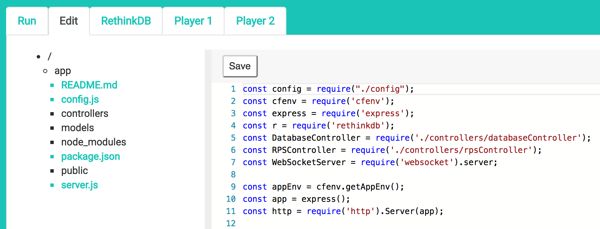

## What is minienv?

minienv is a web application and collection of backend services that allow you to quickly spin up Docker Compose
environments in the cloud that you can access from your web browser.

minienv also includes an online editor that allows you to edit source code or data files included in your Docker Compose
environments. This helps make minienv a great tool for learning (or teaching) new programming languages, databases,
and other technologies right from your browser.

## Why was minienv created?

minienv was created to help make it easier to deliver sample applications and developer tutorials that connect to databases
and other backend services. If you want to learn javascript and frontend web development there are a lot of really great
web-based tools available, like <a href="https://codepen.io/" target="_blank">CodePen</a> and
<a href="https://jsfiddle.net/" target="_blank">JSFiddle</a>, but what if you want to learn how to connect a Node.js
application with MongoDB, or a Jupyter notebook with Apache Spark? With minienv users get their own mini Docker Compose
environments where they can experiment with just about any technology, as long as it can run in a container.

If you are developing sample applications or tutorials and looking for a way to make them more accessible to developers
Docker Compose and minienv may be able to help!

## Who created minienv?

minienv was created by me, Mark Watson. I am a Developer Advocate for IBM. For the last year or so I have been thinking
about and working on ways to make sample applications more accessible to developers. That combined with an abnormal
obsession with containers has resulted in minienv.
 
minienv is open source and available on [GitHub](https://github.com/minienv).
minienv is a side project, built in my free time when I'm not playing with my kids or walking my dog :) 

If you want to learn more or contribute to minienv please contact me: 
markwatsonatx@
[GitHub](https://github.com/markwatsonatx/) |
[Twitter](https://twitter.com/markwatsonatx) |
[LinkedIn](https://www.linkedin.com/in/markwatsonatx/).

## How does it work for the learner?

For the learner minienv is super simple. They simply go to a minienv site in their browser, enter in the
git repo for the Docker Compose based application they want to run, and click the Run button. It looks
something like this:

In future releases we will add a whitelist feature where a learner only has access to a pre-configured list
of sample applications.

## How does it work for the teacher?

Quite simply you have to make your sample applications and tutorials available via containers and Docker Compose.
Docker Compose is a great tool for creating and maintaining multi-container environments, and when you package up 
your applications as Docker Compose environments you've made it really easy for developers to consume them, even without
minienv. Students that have Docker already installed can run your sample applications in minutes with a single command. 
If you need to make those accessible via the web then that's where minienv comes in, and in most cases you will not be
required to make any changes to your Docker Compose environments.

There are some special considerations you need to take into account when packaging your sample applications into Docker
Compose environments. We will share more about this soon...

## How do I set up minienv?

minienv runs inside Kubernetes as a set of Daemon Sets and Deployments (Docker Swarm support coming soon).
Currently, minienv is configured to run using host ports and host path persistent volumes. This allows you to run
minienv on free tier or single node Kubernetes clusters. You can find instructions for setting up minienv in your own Kubernetes
cluster [here](https://github.com/minienv/minienv/tree/master/kubernetes).

